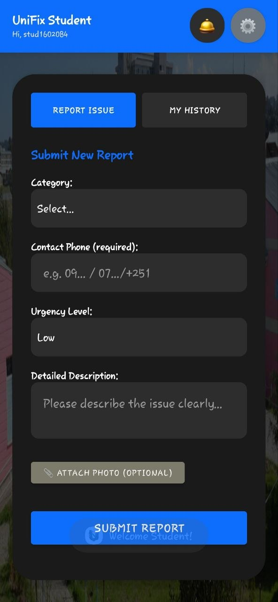
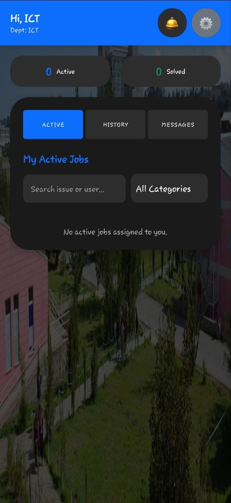
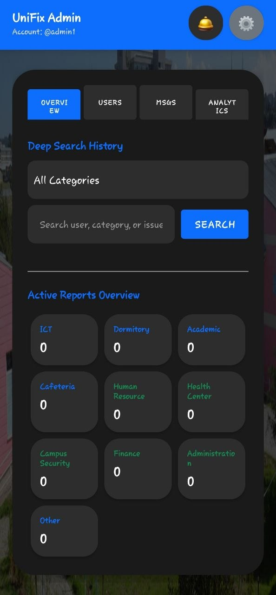

<div align="center">

# 🎓 UniFix
**Smart University Problem Reporting & Management System**


*Bridging the gap between campus staff and students for a seamless university experience.*

</div>

---

## 📖 About The Project

**UniFix** is a comprehensive, multi-role Android application designed to streamline maintenance, ICT, and facility problem reporting across a university campus. By replacing outdated manual reporting methods with a real-time, digital workflow, UniFix ensures that issues are reported quickly, routed to the correct department accurately, and resolved efficiently.

---

## 📱 Application Dashboards

UniFix features tailored interfaces for four distinct user roles.

| 🎓 Student Dashboard | 📚 Teacher Dashboard |
|:---:|:---:|
|  |  |
| *Submit issues, upload photo evidence, and track real-time ticket progress.* | *Specialized reporting for academic resources, classrooms, and office tech.* |

| 🔧 Solver (Staff) Dashboard | 👑 Admin Dashboard |
|:---:|:---:|
|  |  |
| *Accept, decline, delegate tasks, and manage dynamic deadlines.* | *Campus analytics, user management, PDF/CSV exports, and manual reviews.* |

---

## ✨ Core Features

* **🔐 Role-Based Access Control:** Secure, customized environments for Students, Teachers, Solvers, and Admins.
* **🆔 Smart ID Verification:** Utilizes **Google ML Kit** (OCR & Barcode scanning) to automatically verify physical Student and Teacher ID cards during registration.
* **🌍 Bilingual Support:** Real-time UI translation toggling between **English** and **Amharic (አማርኛ)**.
* **🌗 Adaptive UI:** Premium interface with dynamic Light and Dark mode toggling that respects system settings.
* **🛎️ Real-Time System Alerts:** A global notification bell system that alerts users when tasks are assigned, appealed, or resolved.
* **💬 Communication Center:** Integrated private messaging and ticket-specific Group Chats for seamless collaboration.
* **📊 Analytics & Export:** Admins have access to real-time interactive charts and can export campus performance reports directly to **PDF** and **CSV**.
* **⏳ Dynamic Deadlines:** Automated tracking of ticket urgency (Urgent, High, Medium, Low) with visual overdue warnings.

---

## 🛠️ Technology Stack

* **Frontend:** Java, Android XML, Material Components
* **Backend & Database:** Firebase Cloud Firestore
* **Storage:** Firebase Storage (for issue attachments and user data)
* **Authentication:** Firebase Auth & Custom Role-Based Logic
* **Machine Learning:** Google ML Kit (Text Recognition API, Barcode Scanning API)
* **Libraries Used:** * `Glide` - Image loading and caching
    * `MPAndroidChart` - Beautiful, interactive data visualization
    * `android.graphics.pdf.PdfDocument` - Native PDF generation

---

## 📂 Project Architecture

```text
UniFix/
├── app/
│   ├── src/
│   │   ├── main/
│   │   │   ├── java/com/UniFix/unifix/
│   │   │   │   ├── AdminDashboardActivity.java
│   │   │   │   ├── SolverDashboardActivity.java
│   │   │   │   ├── StudentDashboardActivity.java
│   │   │   │   └── TeacherDashboardActivity.java
│   │   │   ├── res/
│   │   │   │   ├── layout/          # XML UI layouts
│   │   │   │   └── drawable/        # App assets, icons, backgrounds
│   │   │   └── AndroidManifest.xml
├── screenshots/                     # Project visual documentation
│   ├── admin_dash.png
│   ├── solver_dash.png
│   ├── student_dash.png
│   └── teacher_dash.png
├── build.gradle
└── README.md